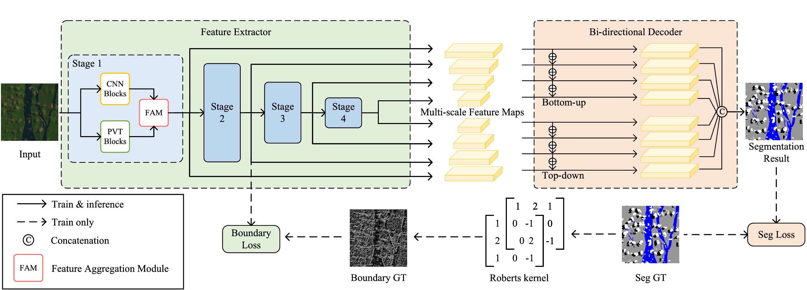
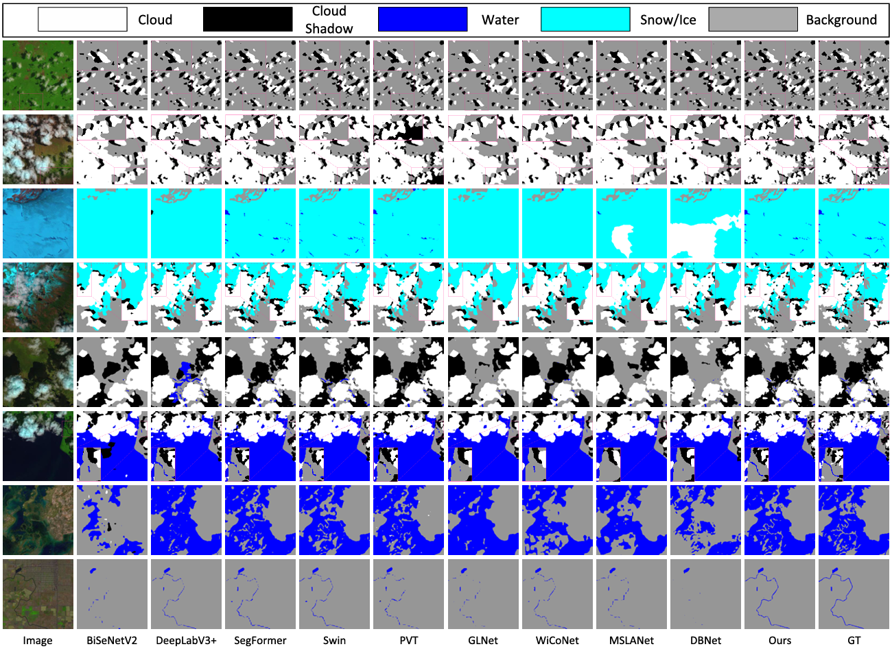
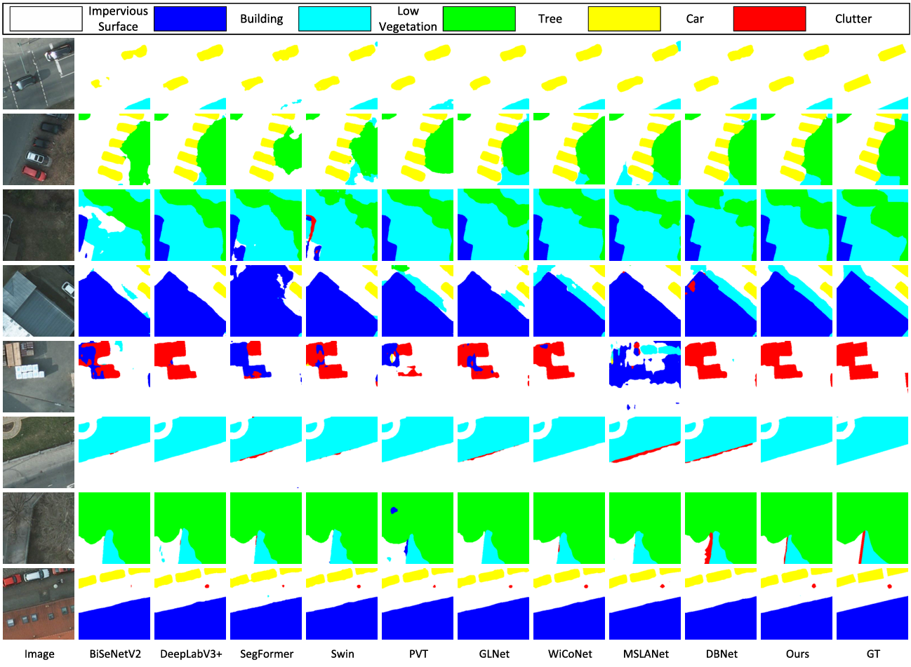
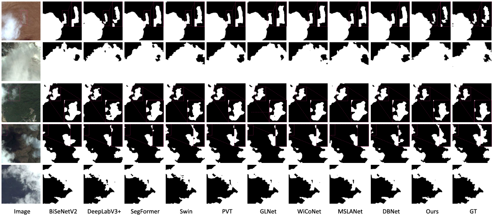

# CTCFNet: CNN and Transformer Complementary and Fusion Network for Semantic Segmentation of High-Resolution Remote Sensing Images (TGRS 2024) [](https://doi.org/10.1109/tgrs.2024.3458446)  [](https://doi.org/10.1109/tgrs.2024.3458446)

## Contributions
- We propose a CTCFNet for the semantic segmentation
of high-resolution remote sensing images. CTCFNet
effectively integrates the strengths of CNNs and Trans
formers through a well-designed feature extractor and a
BiDecoder, resulting in precise segmentation outcomes.

- For local and global feature extraction, we design a
feature extractor that incorporates both CNN and PVT
blocks to, respectively, capture complementary local and
global information. Additionally, a boundary loss func
tion is introduced to enhance the extraction of texture
and boundary information in remote sensing images,
leading to more detailed segmentation boundaries.

- For local and global feature fusion, the FAM first merges
the local and global features at the same scale. Follow
ing this, a BiDecoder processes the multiscale features
in both top-down and bottom-up directions, enabling
the complementary integration of different feature
types.

<figure>
  
  <figcaption>Overall framework of CTCFNet for semantic segmentation of high-resolution remote sensing images. Multiscale feature maps are composed of the
output feature maps of each stage in the feature extractor, and their sizes are 1/4, 1/8, 1/16, and 1/32 of the original image, respectively.</figcaption>
</figure>

## Results
### Results on L8SPARCS
<figure>
  
</figure>

### Results on ISPRS Potsdam
<figure>
  
</figure>

### Results on HRC_WHU
<figure>
  
</figure>


## Environment Installation
The code was tested with the following main environment:
```text
Python == 3.7.10  PyTorch == 1.9.0   TorchVision == 0.10.0
```
More detailed package versions are listed in environment.txt

### 1. Clone the repository
```bash
git clone https://github.com/ChenLu0000/CTCFNet.git
cd CTCFNet
```
### 2. Create the conda environment
```bash
conda create -n CTCFNet python=3.7 -y
conda activate CTCFNet
```
### 3. Install dependencies
```bash
pip install torch==1.9.0 torchvision==0.10.0
pip install -r requirements.txt
```
## Training and Inference
```bash
python main.py
```
## Citation
If you find this work useful for your research, please cite our paper:
```bibtex
@article{lu2024ctcfnet,
  title={CTCFNet: CNN-transformer complementary and fusion network for high-resolution remote sensing image semantic segmentation},
  author={Lu, Chen and Zhang, Xian and Du, Kaile and Xu, Han and Liu, Guangcan},
  journal={IEEE Transactions on Geoscience and Remote Sensing},
  volume={62},
  pages={1--17},
  year={2024},
  publisher={IEEE},
  doi={https://doi.org/10.1109/tgrs.2024.3458446}
}
```